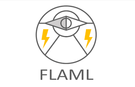

# Fast and Lightweight AutoML Library By Microsoft (FLAML)

- References:
    - [FLAML - Pypl](https://pypi.org/project/FLAML/)
    - [FLAML - Getting Started](https://microsoft.github.io/FLAML/docs/Getting-Started/)
    - [FLAML - A Fast Library for Automated Machine Learning & Tuning](https://microsoft.github.io/FLAML/)
    - [FLAML - repo](https://github.com/microsoft/FLAML)
    - [FLAML - Fast and Lightweight AutoML Library By Microsoft](https://www.youtube.com/watch?v=kaEtrkDknTA)